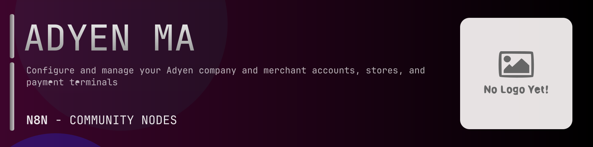

# @n8n-dev/n8n-nodes-adyen-managementservice



[](https://www.npmjs.com/package/@n8n-dev/n8n-nodes-adyen-managementservice)
[](https://opensource.org/licenses/MIT)

---

**Stop writing adyen-managementservice API integrations by hand.**

Every time you connect n8n to adyen-managementservice, you waste hours mapping endpoints, defining parameters, and debugging schemas. You copy-paste from docs, fix edge cases, and pray nothing breaks.

**What if connecting n8n to adyen-managementservice took 5 minutes, not half a day?**

This node gives you **27+ resources** out of the box: **API Key Merchant Level**, **Account Merchant Level**, **Allowed Origins Company Level**, **API Key Company Level**, **Client Key Company Level**, and 22 more: with full CRUD operations, typed parameters, and zero manual configuration.

---

## What You Get

- **Zero boilerplate**: Resources, operations, and fields are pre-configured and ready to use
- **Full CRUD**: Create, read, update, and delete support where the API allows it
- **Typed parameters**: No more guessing field types
- **Built-in auth**: API key authentication, ready to go
- **Declarative**: Native n8n performance, no custom execute() overhead

---

## Install

```bash
npm install @n8n-dev/n8n-nodes-adyen-managementservice
```

**Or in n8n:**
1. **Settings → Community Nodes → Install**
2. Search: `@n8n-dev/n8n-nodes-adyen-managementservice`
3. Click **Install**

---

## Quick Start

1. Install the node (above)
2. Add credentials: **adyen-managementservice API** → paste your API key
3. Drag the **adyen-managementservice** node into your workflow
4. Pick a resource → pick an operation → done.

That's it. No configuration files. No code. It just works.

---

## Resources

| Resource | Operations |
|----------|------------|
| API Key Merchant Level | Post generate new api key |
| Account Merchant Level | Get a list of merchant accounts, Post create a merchant account, Get a merchant account, Post request to activate a merchant account |
| Allowed Origins Company Level | Get a list of allowed origins, Post create an allowed origin, Delete an allowed origin, Get an allowed origin |
| API Key Company Level | Post generate new api key |
| Client Key Company Level | Post generate new client key |
| Users Company Level | Get a list of users, Post create a new user, Get user details, Patch update user details |
| Terminal Actions Terminal Level | Post create a terminal action |
| Terminal Settings Terminal Level | Get the terminal logo, Patch update the logo, Get terminal settings, Patch update terminal settings |
| Payout Settings Merchant Level | Get a list of payout settings, Post add a payout setting, Delete a payout setting, Get a payout setting, Patch update a payout setting |
| Webhooks Merchant Level | Get list all webhooks, Post set up a webhook, Delete remove a webhook, Get a webhook, Patch update a webhook, Post generate an hmac key, Post test a webhook |
| Client Key Merchant Level | Post generate new client key |
| Terminal Orders Company Level | Get a list of billing entities, Get a list of shipping locations, Post create a shipping location, Get a list of terminal models, Get a list of orders, Post create an order, Get an order, Patch update an order, Post cancel an order, Get a list of terminal products |
| Allowed Origins Merchant Level | Get a list of allowed origins, Post create an allowed origin, Delete an allowed origin, Get an allowed origin |
| API Credentials Merchant Level | Get a list of api credentials, Post create an api credential, Get an api credential, Patch update an api credential |
| Users Merchant Level | Get a list of users, Post create a new user, Get user details, Patch update a user |
| Terminal Actions Company Level | Get a list of android apps, Get a list of android certificates, Get a list of terminal actions, Get terminal action |
| Payment Methods Merchant Level | Get all payment methods, Post request a payment method, Get payment method details, Patch update a payment method, Post add an apple pay domain, Get apple pay domains |
| My API Credential | Get api credential details, Get allowed origins, Post add allowed origin, Delete remove allowed origin, Get allowed origin details |
| Terminal Settings Merchant Level | Get the terminal logo, Patch update the terminal logo, Get terminal settings, Patch update terminal settings |
| Webhooks Company Level | Get list all webhooks, Post set up a webhook, Delete remove a webhook, Get a webhook, Patch update a webhook, Post generate an hmac key, Post test a webhook |
| Terminals Terminal Level | Get a list of terminals |
| Account Store Level | Get a list of stores, Post create a store, Get a store, Patch update a store, Get a list of stores, Post create a store, Get a store, Patch update a store |
| Terminal Settings Company Level | Get the terminal logo, Patch update the terminal logo, Get terminal settings, Patch update terminal settings |
| API Credentials Company Level | Get a list of api credentials, Post create an api credential, Get an api credential, Patch update an api credential |
| Terminal Orders Merchant Level | Get a list of billing entities, Get a list of shipping locations, Post create a shipping location, Get a list of terminal models, Get a list of orders, Post create an order, Get an order, Patch update an order, Post cancel an order, Get a list of terminal products |
| Account Company Level | Get a list of company accounts, Get a company account, Get a list of merchant accounts |
| Terminal Settings Store Level | Get the terminal logo, Patch update the terminal logo, Get terminal settings, Patch update terminal settings, Get the terminal logo, Patch update the terminal logo, Get terminal settings, Patch update terminal settings |

---

## Why This Node?

**Without this node:**
- Hours of manual API integration
- Copy-pasting from adyen-managementservice docs
- Debugging auth, pagination, error handling
- Maintaining your own client code

**With this node:**
- Install → configure → use. 5 minutes.
- Auto-generated from the official adyen-managementservice OpenAPI spec
- Always up to date when the API changes
- Native n8n performance

---

## Auto-Generated
This node was auto-generated from the official **adyen-managementservice** OpenAPI specification using
[@n8n-dev/n8n-openapi-node-ultimate](https://github.com/kelvinzer0/n8n-openapi-node-ultimate),
then validated against the live API so you get accurate types and real parameters, not guesswork.

When the adyen-managementservice API updates, this node updates too.

---

## Support This Project

If this node saved you hours of work, consider supporting continued development, new APIs, better error handling, and faster updates.

[](https://n8n-code.github.io/membership/#/eyJ0aXRsZSI6IktlZXAgSXQgTW92aW5nIiwiZGVzYyI6Ik9uZSBkZXZlbG9wZXIgYnVpbHQgYSB0b29sIHRoYXQgYXV0by1nZW5lcmF0ZXNcbm44biBub2RlcyBmcm9tIGFueSBPcGVuQVBJIHNwZWMuXG5cbllvdXIgZG9uYXRpb24gZnVuZHMgbmV3IGZlYXR1cmVzLCBtb3JlIEFQSSBzdXBwb3J0LFxuYW5kIGJldHRlciB0b29saW5nIGZvciBldmVyeSBkZXZlbG9wZXIgYWZ0ZXIgeW91LiIsInRhcmdldCI6NTAwMCwiYWRkcmVzc2VzIjp7ImV0aGVyZXVtIjoiMHhmMDU1NWQ0MGRiRkI0ZTNCZjA3MDQ0MjgyQjc4RjJmRTFmNTFFZjcyIiwic29sYW5hIjoiNlpEVk5BYmpZZExEcXo4cGt3VUNHYllaNVV3QlFranB0QzU1Wk5vTFcybVUifSwiZGlzY29yZCI6Imh0dHBzOi8vZGlzY29yZC5nZy9wdERaOGU0aDkzIn0)

---

## License

MIT © [kelvinzer0](https://github.com/n8n-code)
